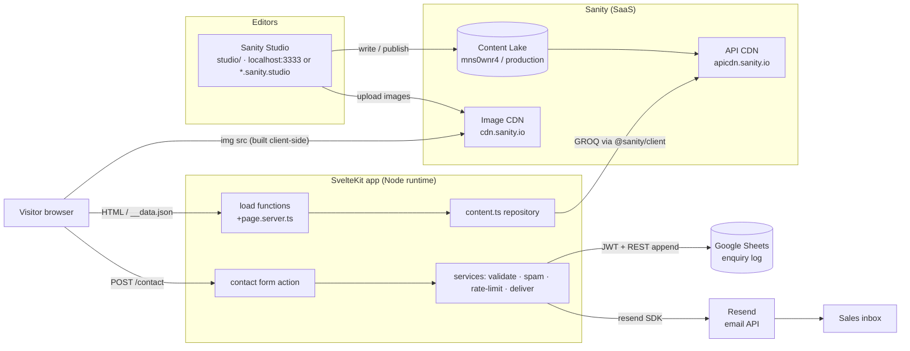
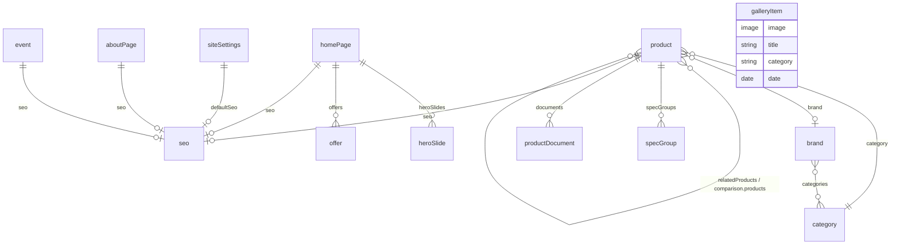
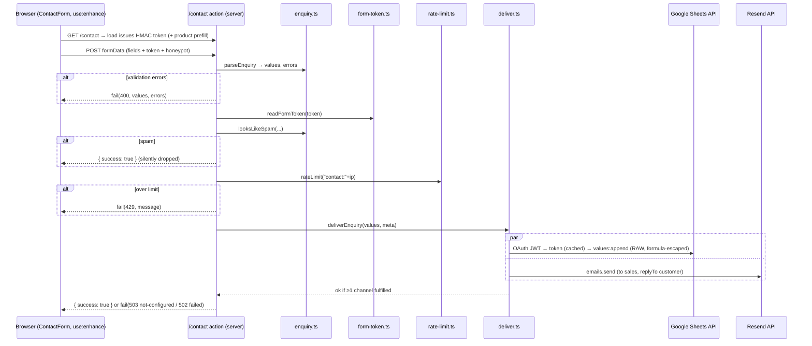
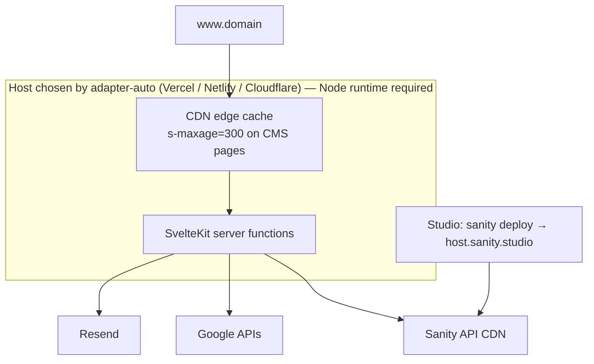
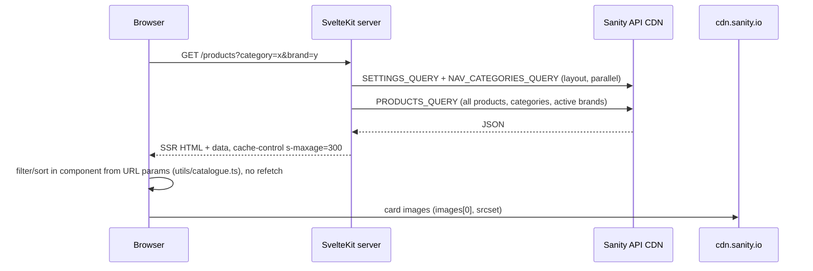

# SKT Technologies website: architecture report

**Status:** analysis only; no code was changed.
**Date:** 2026-09-19.
**Branch:** `mouly`. The gallery-reel work and `HANDOFF.md` are still uncommitted.
**Scope:** every statement below was checked against the code in this repository and against the live Sanity project `mns0wnr4/production`.

---

## A. Verdict: does the stated architecture match the code?

**Yes, with the qualifications listed below.** Every claim in the brief is implemented as described:

| Claim | Verified in | Notes |
| --- | --- | --- |
| SvelteKit 2, Svelte 5 runes, TypeScript, Tailwind 4 | `package.json`, `vite.config.ts`, `src/routes/layout.css` | Runes are forced for all project files (`compilerOptions.runes`). |
| Sanity Content Lake is the content database | `src/lib/sanity/*`, `studio/` | The only content source apart from the bundled sample fallback. |
| No hardcoded CMS content in components | `src/lib/server/content.ts` | All content arrives through `load()`. Structural labels and UI copy live in components. The **sample fallback** holds a copy of the home-page section headings in `content.ts`. |
| Flow: Studio → Lake → GROQ → repository → load → components | See section D | Matches exactly. |
| Contact flow: form action → validation → spam checks → rate limit → Sheets and Resend | `src/routes/contact/+page.server.ts`, `src/lib/server/services/*` | Matches. The order is: **validate → spam → rate limit → deliver**. |
| Sheets stores enquiries only; Resend only sends email | `sheets/google-sheets.ts`, `email/resend.ts` | Correct. Neither is read back anywhere. |
| No other database | whole repo | Correct. No SQL, Mongo or Firebase client. The only local state is the in-memory rate-limit `Map`. |
| Fallback content when Sanity is not configured | `content.ts` (`isSanityConfigured`) | **Only when the project id is empty.** There is **no** fallback when Sanity is configured but unreachable (see section F). |
| Server-only secrets | `$env/dynamic/private`, used only in `*.server.ts` and `src/lib/server/**` | Correct. SvelteKit refuses to bundle these into client code. |

---

## B. Architecture

### B1. High-level system

### B2. Frontend (runs in the browser; SSR first, then hydrated)

- **Rendering:**
  - Every page is server-rendered and then hydrated.
  - Client-side navigation fetches `__data.json` from the same `load` functions.
  - No Sanity client runs in the browser.
- **Images:**
  - `SanityImage.svelte` builds `cdn.sanity.io` URLs on the client and on the server with `@sanity/image-url`.
  - Those URLs apply the hotspot crop, `auto=format`, a `srcset`, and an LQIP (low-quality placeholder) background.
  - Only the public project id and dataset are needed to build them.
- **Motion:**
  - `motion` powers the nav thumb (`RubberSegment`).
  - `ogl` (WebGL) powers the gallery reel (`CircularGallery`), and is loaded only on `/gallery`.
  - CSS handles the scroll reveals, and the View Transitions API handles page changes.
  - Every one of these switches off under `prefers-reduced-motion`.
- **SEO:**
  - `Seo.svelte` renders the title, description, canonical URL, Open Graph tags and JSON-LD.
  - JSON-LD types: `LocalBusiness` on `/`; `Product` and `BreadcrumbList` on product pages; `Event` and `BreadcrumbList` on event pages.

### B3. Backend (SvelteKit server)

| Concern | Implementation |
| --- | --- |
| Sanity reads | `client.server.ts`, with `perspective: 'published'`. `useCdn` is true only when there is **no read token and not in dev**. |
| Caching | `CMS_CACHE` is `s-maxage=300, stale-while-revalidate=86400` on CMS pages. The sitemap uses `s-maxage=3600`. `/contact` is **not** cached, because each render issues a fresh form token. |
| Secrets | `$env/dynamic/private`, read at runtime. |
| Validation | `enquiry.ts`: pure functions with length limits, control-character stripping, and email and phone rules. |
| Spam | Honeypot field `website`. An HMAC-signed render timestamp, which must be at least 2 s and at most 24 h old. Messages with more than 3 links are rejected. Spam gets a fake success response. |
| Rate limit | In-memory fixed window: 5 enquiries per 10 minutes per IP (from `getClientAddress()`). |
| Delivery | `deliver.ts` runs Sheets and Resend in parallel with `Promise.allSettled`. It succeeds if **at least one** channel accepts the enquiry. |
| Errors | `hooks.server.ts` `handleError` logs everything except 404s and returns a generic message. |
| Security headers | `X-Content-Type-Options`, `Referrer-Policy`, `X-Frame-Options`, `Permissions-Policy`. **No CSP or HSTS.** |
| SEO endpoints | `sitemap.xml` (static paths, products, events) and `robots.txt` (controlled by `PUBLIC_ALLOW_INDEXING`). |

### B4. Sanity CMS

- **Studio location:** `studio/`. It is a separate npm project using Sanity v5 with `structureTool` and `visionTool`.
- **Singletons:**
  - `siteSettings`, `homePage` and `aboutPage`, each with a fixed `_id` equal to its type.
  - They are hidden from the "new document" menu.
  - Only publish, discard and restore actions are allowed on them.
- **Images:**
  - Every image field has hotspot enabled. The shared `imageWithAlt` helper warns when alt text is missing.
  - An upload goes to the Sanity asset store and is referenced from the document. It reaches the website only after the document is **published**.
- **Seed scripts:**
  - `seed/seed.ts` imports all sample content.
  - `seed/gallery.ts` imports only the gallery.
  - Both use `SANITY_WRITE_TOKEN`.

### B5. Content model

| Type | Key fields that drive the site | Visibility rule in GROQ |
| --- | --- | --- |
| `product` | `name`, `slug`, `category` (required), `brand`, `images[]` (at least 1; `[0]` is the card image), `mrp`, `discount`, `availability`, `featured`, `specGroups`, `comparison`, `relatedProducts`, `documents` (files), `seo` | `defined(slug.current)` |
| `category` | `title`, `slug`, `description`, `image`, `displayOrder` | `defined(slug.current)` |
| `brand` | `name`, `slug`, `logo`, `categories[]`, `active` | `active != false && defined(slug)` |
| `galleryItem` | `image` (required), `title`, `description`, `category`, `date`, `displayOrder` | `defined(image.asset)` |
| `event` | `title`, `slug`, `published` (**defaults to false**), dates, `coverImage`, `gallery[]`, registration link | `published == true && defined(slug)` |
| `homePage` | `heroSlides` (**1 to 5, required to publish**), `offers` (hidden after `validUntil`, IST), section headings, `contactPrompt`, `seo` | singleton |
| `aboutPage` | heading, intro, image, body, facts, values, process, sectors, milestones | singleton; missing → **404** |
| `siteSettings` | company name, contact details, address, hours, GSTIN, `social` (used only in JSON-LD `sameAs`), default SEO | singleton; missing → name-only fallback |

### B6. Contact workflow

### B7. External services

| Service | Used for | Auth | Called from |
| --- | --- | --- | --- |
| Sanity Content Lake / API CDN | Content reads | Public dataset, no token; optional read token | `client.server.ts` (server) |
| Sanity Image CDN | Images | None. **WebGL textures need the site origin listed under CORS origins.** | Browser |
| Sanity management | Studio editing, seed scripts | Editor login / `SANITY_WRITE_TOKEN` | `studio/` (local or hosted) |
| Google OAuth + Sheets v4 | Appending enquiry rows | Service-account JWT (RS256), 8 s timeout | `google-sheets.ts` (server) |
| Resend | Enquiry notification email | `RESEND_API_KEY`; **no timeout set** | `resend.ts` (server) |

### B8. Deployment

- **Adapter:** `@sveltejs/adapter-auto`. Swap in `adapter-node` for a VPS.
- **Runtime:** needs **Node**, because of `node:crypto` in `form-token.ts` and `google-sheets.ts`. Edge runtimes will not work without Node compatibility.
- **Publishing:** there is no webhook or revalidation hook. Published changes reach production when the edge cache expires, within about 5 minutes. In dev they appear on the next refresh, because the API CDN is bypassed.

---

## C. Module inventory

| Module (path) | Responsibility | Input | Output | Depends on | Runs on |
| --- | --- | --- | --- | --- | --- |
| `src/lib/sanity/config.ts` | Public Sanity coordinates, `isSanityConfigured` | `PUBLIC_SANITY_*` | config object, boolean | `$env/dynamic/public` | both |
| `src/lib/sanity/client.server.ts` | Sanity client, `sanityFetch()` | GROQ string and params | JSON | `@sanity/client`, `SANITY_API_READ_TOKEN` | **server** |
| `src/lib/sanity/queries.ts` | All GROQ queries and fragments (`IMG`, `CARD_FIELDS`, `SEO`) | none | query strings | none | server (imported by the repository) |
| `src/lib/sanity/types.ts` | Flat UI types | none | TS types | none | both (types only) |
| `src/lib/sanity/image.ts` | CDN URLs, `srcset`, aspect ratio | `Img`, width, aspect | URL strings | `@sanity/image-url`, `config.ts` | both |
| `src/lib/server/content.ts` | Repository: `getSettings`, `getNavCategories`, `getHome`, `getCatalogue`, `getProduct`, `getBrands`, `getGallery`, `getEvents`, `getEvent`, `getAbout`, `getSitemapEntries` | slug, if any | UI-shaped data; `null` when not found | `sanityFetch`, `queries`, `sample-content` | **server** |
| `src/lib/server/sample-content.ts` | Offline fallback data (artwork in `static/samples/`) | none | typed objects | `types.ts` | server; also imported by `studio/seed/*` |
| `src/lib/server/cache.ts` | `CMS_CACHE` header | none | header object | none | server |
| `src/routes/+layout.server.ts` | Site settings and nav categories for **every** page | none | `{settings, navCategories}` | `content.ts` | server |
| `src/routes/**/+page.server.ts` | Per-page `load`; sets `CMS_CACHE`; throws 404s | params | page data | `content.ts` | server |
| `src/routes/contact/+page.server.ts` | Form token, product prefill, default action | URL params, FormData | token and prefill; `success` or `fail()` | services, `getCatalogue` | **server** |
| `src/lib/server/services/enquiry.ts` | Parse, validate, spam heuristics | FormData | `{values, errors}`, boolean | none (pure) | server |
| `src/lib/server/services/form-token.ts` | HMAC render-time token | timestamp or token | token, or timestamp or null | `node:crypto`, `CONTACT_FORM_SECRET` | server |
| `src/lib/server/services/rate-limit.ts` | Fixed-window limiter | key | `{ok, retryAfter}` | module `Map` | server (per instance) |
| `src/lib/server/services/deliver.ts` | Fan-out to the channels | `Enquiry`, meta | `DeliveryResult` | Sheets, Resend | server |
| `src/lib/server/services/sheets/google-sheets.ts` | JWT, token cache, row append | `Enquiry`, meta | void or throws | `fetch`, `node:crypto`, `GOOGLE_*` | server |
| `src/lib/server/services/email/resend.ts` | HTML and text email | `Enquiry`, meta | void or throws | `resend`, `RESEND_API_KEY`, `CONTACT_*` | server |
| `src/hooks.server.ts` | Security headers, error logging, preload policy | request | response | none | server |
| `src/routes/sitemap.xml`, `robots.txt` | SEO endpoints | none | XML or text | `content.ts`, `PUBLIC_SITE_URL`, `PUBLIC_ALLOW_INDEXING` | server |
| `src/lib/components/ui/SanityImage.svelte` | Responsive image with LQIP | `Img` | `` | `image.ts` | both |
| `src/lib/components/ui/Seo.svelte` + `src/lib/utils/seo.ts` | Meta tags, JSON-LD | page data | `<head>` tags | `PUBLIC_SITE_URL` | both (SSR output) |
| `src/lib/components/forms/ContactForm.svelte` | Form UI, `use:enhance` | action data | POST | `$app/forms` | client |
| `src/lib/components/gallery/CircularGallery.svelte` + `circular-reel.ts` | WebGL reel | image URLs and titles | canvas | `ogl` | **client only** (created in an attachment) |
| `src/lib/components/navigation/*` | Header, `RubberSegment`, `MobileNav` | settings, categories | nav | `motion` | client |
| `studio/sanity.config.ts`, `structure.ts`, `schemaTypes/*` | Editing UI and schema | editor input | documents and assets | `sanity` | Studio (browser) |
| `studio/seed/seed.ts`, `seed/gallery.ts` | Import sample content | `sample-content.ts`, `static/samples` | documents and assets | `SANITY_WRITE_TOKEN` | Node CLI |

---

## D. Scenarios

### D1. An admin creates or updates a product
1. **Edit in Studio.** The Studio writes a `drafts.<id>` document; images are uploaded to the asset store straight away.
2. **Publish.** Validation must pass: a name, slug, category, availability and **at least one image**. Publishing replaces `<id>` with the draft contents.
3. **Pick-up by the site.** The site reads with `perspective: 'published'`, so drafts are never shown.
   - Dev: visible on the next page load.
   - Production: visible after the edge cache (up to 300 s) and the API CDN expire.
4. **Knock-on effects:**
   - A product with `featured` set appears on `/` (the first 8, by `displayOrder`).
   - A new slug appears in `sitemap.xml` (cached for 1 h) unless `seo.noIndex` is set.
   - **Changing the slug breaks old URLs.** There is no redirect mechanism.

### D2. A visitor opens `/products`

The server `load` deliberately never reads `searchParams`, so changing a filter never triggers another request.

### D3. A visitor opens `/products/[slug]`
1. The layout `load` runs `getSettings` and `getNavCategories`.
2. `getProduct(slug)` runs `PRODUCT_QUERY`, which fetches in one round trip:
   - the card fields, all images, the overview (Portable Text), features and spec groups;
   - the comparison products together with their spec groups;
   - the documents (file URLs);
   - `related`, falling back to `sameCategory` (4 products);
   - the SEO fields.
3. The repository then cleans the result:
   - drops images with no URL and null related entries (unpublished references);
   - removes an empty comparison.
4. If nothing is found, the response is a **404** (`error(404)`).
5. The page renders `ProductGallery`, `Price` (MRP minus discount), `SpecTable`, `ComparisonTable`, `productLd` and `breadcrumbLd`.
6. The "Request a quote" link goes to `/contact?product=<slug>`.

### D4 and D5. A visitor submits the contact form, and the enquiry is saved and emailed
See the sequence diagram in section B6. The details:

- **Sheets row:** columns A:I are `Received (IST)`, `Name`, `Email`, `Phone`, `Company`, `Subject`, `Message`, `Product`, `Page`. Cells are escaped against formula injection (`= + - @`).
- **Email:** sent to the comma-separated `CONTACT_TO_EMAIL` addresses, from `CONTACT_FROM_EMAIL`, with the customer set as `replyTo`. Content is HTML-escaped. No auto-reply is sent to the visitor.
- **When one channel fails:** the error is logged and the visitor still sees success as long as the other channel worked.
- **When both fail:** the response is 502.
- **When neither is configured:** dev logs the enquiry to the console; production returns **503**.

### D6. Sanity is unavailable or not configured

| Condition | Behaviour (verified) |
| --- | --- |
| `PUBLIC_SANITY_PROJECT_ID` empty | Every repository function returns the sample content. The site is fully browsable. |
| Configured, dataset empty (**current state**) | Header and footer show only "SKT Technologies". The home page has no hero and no sections. `/about` returns **404**. Products, brands and events are empty. The gallery has the 8 seeded items. |
| Configured, Sanity down or slow | `sanityFetch` throws and the layout `load` fails, so **every page returns 500**. No timeout, retry or stale fallback. Only the edge cache (`stale-while-revalidate`) softens this, and only for pages it already holds. |
| Image CDN blocks the origin (CORS) | `` tags still work. The WebGL reel shows grey cards and logs a console hint. |

---

## E. Environment variables (names only; no values shown)

| Variable | File | Class | Used in | Needed in production? |
| --- | --- | --- | --- | --- |
| `PUBLIC_SITE_URL` | `.env` | Public | `Seo.svelte`, JSON-LD, sitemap, robots | **Yes**. It currently holds the `.env.example` placeholder (`www.example.com`). |
| `PUBLIC_ALLOW_INDEXING` | `.env` | Public, optional | `robots.txt` | Yes (`false` on staging) |
| `PUBLIC_SANITY_PROJECT_ID` | `.env` | Public | `config.ts` | **Yes** (set) |
| `PUBLIC_SANITY_DATASET` | `.env` | Public, optional (default `production`) | `config.ts` | Yes (set) |
| `PUBLIC_SANITY_API_VERSION` | `.env` | Public, optional | `config.ts` | Optional (set) |
| `SANITY_API_READ_TOKEN` | `.env` | **Server secret**, optional | `client.server.ts` | Only for a private dataset. Keep empty: when set it disables the API CDN. (Now empty.) |
| `RESEND_API_KEY` | `.env` | **Server secret** | `resend.ts` | **Yes**, for email (empty) |
| `CONTACT_TO_EMAIL` | `.env` | Server config | `resend.ts` | **Yes**. It currently holds a placeholder (`sales@example.com`). |
| `CONTACT_FROM_EMAIL` | `.env` | Server config | `resend.ts` | **Yes**. Must be on a domain verified in Resend. It currently holds a placeholder. |
| `GOOGLE_SERVICE_ACCOUNT_EMAIL` | `.env` | Server config | `google-sheets.ts` | **Yes**, for Sheets (empty) |
| `GOOGLE_PRIVATE_KEY` | `.env` | **Server secret** | `google-sheets.ts` | **Yes**, for Sheets (empty) |
| `GOOGLE_SHEET_ID` | `.env` | Server config | `google-sheets.ts` | **Yes**, for Sheets (empty) |
| `GOOGLE_SHEET_NAME` | `.env` | Server config, optional (default `Enquiries`) | `google-sheets.ts` | Optional (set) |
| `CONTACT_FORM_SECRET` | `.env` | **Server secret** | `form-token.ts` | **Yes**. See issue F2. (Empty.) |
| `SANITY_STUDIO_PROJECT_ID` | `studio/.env` | Studio (bundled into the Studio build; public) | `sanity.config.ts`, `sanity.cli.ts`, seeds | Yes, for the Studio (set) |
| `SANITY_STUDIO_DATASET` | `studio/.env` | Studio | same | Yes (set) |
| `SANITY_STUDIO_HOST` | `studio/.env` | Studio, optional | `sanity.cli.ts` (deploy) | Only to host the Studio (empty) |
| `SANITY_WRITE_TOKEN` | `studio/.env` | **Studio-only secret** (CLI only; no `SANITY_STUDIO_` prefix, so it is not bundled) | `seed/*.ts` | No. Revoke it after seeding. (Set.) |

Both `.env` files are git-ignored. A scan of the client bundle found no private variable names in client code.

---

## F. Problems and risks found

Ordered by impact.

1. **A Sanity outage takes down the whole site (500).**
   - `+layout.server.ts` calls `sanityFetch` on every request.
   - There is no try/catch, timeout or fallback to last-known content.
2. **Real enquiries can be silently discarded in production.**
   - With `CONTACT_FORM_SECRET` empty, `form-token.ts` signs tokens with a **random secret per process**.
   - On serverless or multi-instance hosting, or after any restart between page load and submit, the token fails verification.
   - `looksLikeSpam` then treats the submission as spam and returns a **fake success**, so the lead is lost with no log entry.
3. **The contact form is not wired to any channel yet.**
   - `RESEND_API_KEY` and all `GOOGLE_*` variables are empty, and `CONTACT_*_EMAIL` hold placeholders.
   - In production every submission would return 503.
   - Sheets has not been tested end to end; neither channel has been run against a real account.
4. **Placeholder `PUBLIC_SITE_URL` (`www.example.com`)** would put wrong canonical URLs, Open Graph URLs and sitemap entries in production.
5. **The CMS is nearly empty.**
   - It holds only 8 `galleryItem` documents (plus their image assets).
   - There are no `siteSettings`, `homePage`, `aboutPage`, products, categories, brands or events, so most pages render empty and `/about` returns 404.
   - To publish `homePage`, the Studio requires at least 1 hero slide.
6. **Each site origin must be added to Sanity CORS origins** for the gallery reel (WebGL textures): production, preview deployments and any other dev port. Plain `` tags are unaffected. Only `http://localhost:3333` and `:5173` are listed now.
7. **The rate limiter is per instance.** On serverless it resets per cold instance, so it is weak protection.
8. **The Resend call has no timeout**, unlike Sheets (8 s). A slow Resend response delays the form response.
9. **The `/contact` load fetches the whole catalogue** to resolve one product name. This is wasteful, and it also makes `/contact` fail when Sanity is down (issue 1).
10. **No publish hook.** Edits can take up to about 5 minutes to appear in production. There is no draft preview or Visual Editing, so editors can't check a change before publishing.
11. **Events default to `published: false`.** Editors must also tick "Show on website"; the Studio's own Publish button alone doesn't make an event appear. This is intentional, but easy to miss.
12. **No redirects for slug changes.** Renaming a slug returns a 404 for old links and search results.
13. **Minor inconsistency:** `GALLERY_QUERY` defaults a missing `category` to `"products"`, while the schema's `initialValue` is `"installations"`.
14. **No CSP or HSTS headers.** HSTS is often added by the host.
15. **Runtime constraint:** `node:crypto` rules out edge runtimes (Vercel Edge, Cloudflare without `nodejs_compat`).
16. **Uncommitted work:**
    - new files: `HANDOFF.md`, the gallery reel, `studio/seed/gallery.ts`;
    - edited files: `package.json`/`package-lock.json` (the `ogl` dependency), `vite.config.ts`, `Icon.svelte`, `gallery/+page.svelte`, `studio/package.json`.

No dead modules were found: every component and utility is imported somewhere. `settings.social` is editable in the Studio but appears only in JSON-LD `sameAs`, not in the visible UI.

---

## Summary

### 1. Confirmed architecture
SvelteKit 2 SSR app (Svelte 5 runes, TypeScript, Tailwind 4) → server-only repository → Sanity Content Lake over GROQ. Images come straight from the Sanity Image CDN. The contact form uses a SvelteKit form action → validation → spam checks → rate limit → Google Sheets and Resend in parallel. There is no other database. The brief is accurate, except that the sample-content fallback applies **only when Sanity is unconfigured**, not when it is unavailable.

### 2. Actual data flow
- **Content:** Studio publish → Content Lake → (API CDN) → `sanityFetch` in `content.ts` → `+page.server.ts` / `+layout.server.ts` → SSR HTML and `__data.json` (edge-cached 300 s) → components.
- **Images:** components → `imageUrl()` → `cdn.sanity.io` (hotspot crop, `auto=format`).
- **Enquiries:** browser POST → `contact/+page.server.ts` → `enquiry.ts` → `form-token.ts` → `rate-limit.ts` → `deliver.ts` → Sheets `values:append` and Resend `emails.send`.

### 3. Databases and external services
- Sanity Content Lake (content and assets) and the Sanity Image CDN.
- Google Sheets, as the enquiry log only.
- Resend, as email delivery only.

### 4. Files responsible for each flow

| Flow | Files |
| --- | --- |
| **Content** | `studio/schemaTypes/**` → `src/lib/sanity/{config,client.server,queries,types}.ts` → `src/lib/server/content.ts` → `src/routes/**/+page.server.ts` and `+layout.server.ts` → `src/lib/components/**` |
| **Images** | `studio` image fields → `queries.ts` `IMG` → `src/lib/sanity/image.ts` → `SanityImage.svelte`, `HeroPrint.svelte`, `CircularGallery.svelte` |
| **Enquiries** | `ContactForm.svelte` → `src/routes/contact/+page.server.ts` → `src/lib/server/services/{enquiry,form-token,rate-limit,deliver}.ts` → `sheets/google-sheets.ts` and `email/resend.ts` |
| **SEO** | `Seo.svelte`, `utils/seo.ts`, `routes/sitemap.xml`, `routes/robots.txt` |

### 5. Missing or incomplete integrations
- Resend credentials and a verified sending domain.
- The Google service account and the sheet.
- `CONTACT_FORM_SECRET`.
- A real `PUBLIC_SITE_URL` and a real `CONTACT_TO_EMAIL`.
- The content itself: settings, home, about, catalogue and events.
- CORS origins for the production and preview domains.
- A Sanity-down fallback.
- A publish webhook or revalidation, and draft preview.
- Slug redirects.
- A shared rate-limit store, if hosting on serverless.

### 6. Recommended next steps
1. **Make image uploads show on the site (the stated goal).** This already works for every image field:
   - upload in the Studio, set the hotspot and alt text, and **Publish**;
   - to make it complete, create the singletons (Company & site settings, Home page with at least 1 hero slide, About page) and at least one category and product;
   - or run `cd studio && npm run seed` once, then replace the images.
2. **Harden the Sanity reads** in `client.server.ts` and `+layout.server.ts`:
   - add a request timeout;
   - catch errors in the layout `load` and fall back to minimal settings, so a Sanity outage doesn't return 500 for the whole site.
3. **Fix the silent lead loss:**
   - make `CONTACT_FORM_SECRET` mandatory in production (fail loudly at startup, or log token failures);
   - consider treating an invalid token as a normal validation error ("please reload") rather than as spam.
4. **Configure delivery:** Resend (verify the domain, set the key, real `CONTACT_TO_EMAIL`) and Sheets (service account, share the sheet); then test end to end. Add a timeout to the Resend call.
5. **Before launch:** set `PUBLIC_SITE_URL`; add the production domain to Sanity CORS origins; choose a host with a Node runtime; deploy the Studio (`SANITY_STUDIO_HOST`); revoke `SANITY_WRITE_TOKEN`.
6. **Optional, for editors:**
   - a Sanity webhook for instant cache purges;
   - Presentation/Visual Editing for draft preview;
   - a redirect document type for slug changes.
7. **Clean up:** resolve the gallery `category` default mismatch; slim down the `/contact` product lookup to a single-slug query; commit the pending work.
